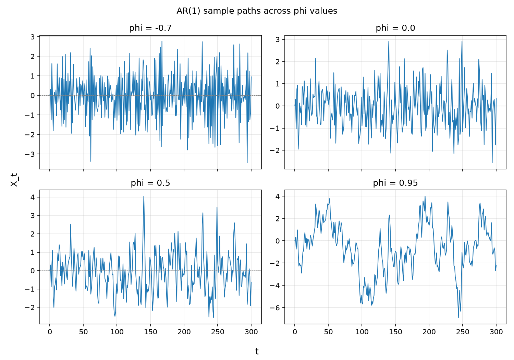
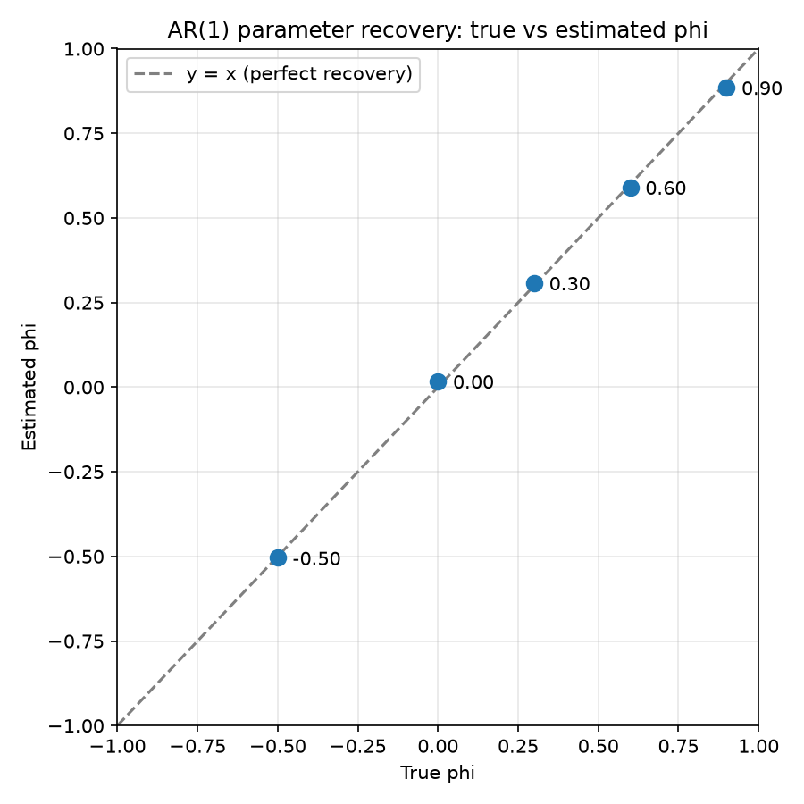

# AR(1) Process: Simulation, Estimation and Forecasting

## 1. Motivation

The Hurst estimation project asked whether FTSE 100 returns carry long range memory. This project asks the simpler, classical version of the same question: is there any short range linear dependence between one day's return and the next?

The first order autoregressive process, AR(1), is the standard model for this. It is the simplest process in which today's value depends on yesterday's, governed by a single parameter $\phi$. This project simulates the process, checks that its parameters can be recovered from data with known ground truth, and then fits the same model to real FTSE 100 log returns to test whether it forecasts anything.

## 2. Formal Definitions

**Definition 2.1 (AR(1) Process).** A stochastic process $\{X_t\}_{t \geq 0}$ is a first order autoregressive process if

$$X_t = c + \phi X_{t-1} + \varepsilon_t, \qquad \varepsilon_t \overset{\text{i.i.d.}}{\sim} \mathcal{N}(0, \sigma^2),$$

where $c$ is a constant, $\phi$ is the autoregressive coefficient, and $\sigma^2$ is the noise variance.

**Definition 2.2 (Stationarity).** The process of Definition 2.1 is (weakly) stationary if and only if $|\phi| < 1$. In that case

$$\mathbb{E}[X_t] = \frac{c}{1-\phi}, \qquad \text{Var}(X_t) = \frac{\sigma^2}{1-\phi^2}, \qquad \rho(k) = \phi^{k},$$

where $\rho(k)$ is the autocorrelation at lag $k$.

**Remark 1.** The two ends of the parameter range recover processes seen earlier in this repository. When $\phi = 0$ the process is white noise, with no memory at all. As $\phi \to 1$ the process approaches a random walk, the discrete analogue of the standard Brownian motion from the first project, and the variance in Definition 2.2 diverges.

**Remark 2.** The sign of $\phi$ controls the character of the path. For $\phi > 0$ a positive value tends to be followed by a positive value, producing slow wandering. For $\phi < 0$ values tend to alternate in sign, producing rapid zig-zags. Figure 1 shows both.

**Remark 3 (Short memory versus long memory).** The autocorrelation $\rho(k) = \phi^k$ decays geometrically, so $\sum_k |\rho(k)| < \infty$. This is short memory, in contrast to the slowly decaying autocorrelations of fractional Brownian motion with $H > 1/2$ (Definition 3.3 of the fBm project). The two projects therefore test two different kinds of dependence.

## 3. Method

### 3.1 Simulation

Paths are generated directly from Definition 2.1, started at the stationary mean $c/(1-\phi)$ so that the process begins at its long run level rather than at an arbitrary point.

### 3.2 Estimation

Given a series $X_0, \dots, X_n$, the parameters are estimated by ordinary least squares, regressing $X_t$ on $X_{t-1}$:

$$\hat{\phi} = \frac{\sum_{t=1}^{n} (X_{t-1} - \bar{X}_{-})(X_t - \bar{X}_{+})}{\sum_{t=1}^{n} (X_{t-1} - \bar{X}_{-})^2}, \qquad \hat{c} = \bar{X}_{+} - \hat{\phi}\,\bar{X}_{-},$$

where $\bar{X}_{-}$ and $\bar{X}_{+}$ are the means of the lagged and current values.

### 3.3 Forecasting

The one step ahead forecast is $\hat{X}_{t+1} = \hat{c} + \hat{\phi} X_t$. It is scored by root mean squared error (RMSE) against a naive baseline that always forecasts a zero return.

### 3.4 Two parts

**Part A (validation).** Simulate AR(1) paths of length 2000 at known values $\phi \in \{-0.5, 0, 0.3, 0.6, 0.9\}$ with $c = 0$ and $\sigma = 1$, estimate $\phi$, and compare against the truth.

**Part B (application).** Compute daily log returns from the FTSE 100 closing prices used throughout this repository, fit the AR(1) model, and evaluate the one step ahead forecast against the naive baseline.

## 4. Results

### 4.1 Sample paths



**Figure 1.** AR(1) sample paths at $\phi = -0.7, 0, 0.5, 0.95$, generated with the same random seed. The negative coefficient produces rapid alternation around zero, $\phi = 0$ is plain noise, and $\phi = 0.95$ produces long slow swings, consistent with a process close to a random walk (Remark 1).

### 4.2 Parameter recovery



**Figure 2.** Estimated against true $\phi$ for seed 42. All five points lie close to the line $y = x$.

The validation was repeated across five seeds (1, 2, 3, 42, 100) to check that recovery is not an artefact of one random draw.

| True $\phi$ | Mean estimate (5 seeds) | Largest absolute error |
|---|---|---|
| -0.5 | -0.514 | 0.035 |
| 0.0 | 0.013 | 0.026 |
| 0.3 | 0.307 | 0.028 |
| 0.6 | 0.598 | 0.031 |
| 0.9 | 0.894 | 0.014 |

Across all 25 runs the mean absolute error was 0.0136 and the largest was 0.0348. Unlike the Hurst estimator, there is no systematic bias at the ends of the parameter range. This is expected, since OLS is a consistent estimator for AR(1) and 2000 observations is plenty.

### 4.3 Application to the FTSE 100

Fitting the model to FTSE 100 daily log returns gives

| Quantity | Value |
|---|---|
| $\hat{c}$ | 0.000493 |
| $\hat{\phi}$ | 0.00558 |
| AR(1) forecast RMSE | 0.0070436 |
| Naive (zero return) forecast RMSE | 0.0070611 |

The estimated coefficient is indistinguishable from zero. Under the null of white noise, the standard error of $\hat{\phi}$ is approximately $1/\sqrt{n} \approx 0.036$ for the roughly 758 daily returns used, so $\hat{\phi}$ lies about 0.15 standard errors from zero.

The AR(1) forecast beats the naive baseline by about 0.25 percent. This is not evidence of predictive skill. The model is scored on the same data it was fitted to, so even this figure is optimistic. And with $\hat{\phi} \approx 0$ the forecast is almost constant at $\hat{c}$, the average daily return, so the small gain comes from the drift term rather than from any dependence between consecutive days.

The finding is that daily FTSE 100 returns show negligible linear autocorrelation, consistent with the market being very hard to forecast from its own recent past.

**Link to the Hurst result.** The Hurst project estimated an exponent of about 0.569 for the same data, which on its face suggests mild persistence. Its validation showed the R/S estimator reads about 0.56 for a series whose true $H$ is exactly 0.5. Together with $\hat{\phi} \approx 0$ here, this suggests the FTSE value is largely explained by the estimator's small sample upward bias rather than by genuine memory.

## 5. Verification

Five automated unit tests (Catch2) verify: OLS recovers $\phi$ and $c$ exactly on a noiseless deterministic series; simulated paths have the correct length; simulation is reproducible under a fixed seed; the estimator recovers $\phi$ within tolerance on noisy data; and the sample mean of a long stationary path approaches the theoretical mean $c/(1-\phi)$.

Writing the first of these tests exposed a genuine edge case. A noiseless path started at its stationary mean is constant, so its variance is zero and the OLS slope is undefined (division by zero). The test therefore starts the deterministic path away from equilibrium, so that there is variation to regress on.

## 6. Reproducing this Project

**Building:**
```
cmake -S ar1 -B ar1/build
cmake --build ar1/build
```

**Running** (optional seed, default 42):
```
ar1.exe [seed]
```

**Running the test suite:**
```
ar1_tests.exe
```

**Visualising results:**
```
pip install -r requirements.txt
python plot_ar1_validation.py
python plot_ar1_paths.py
```

**Running the seed sweep:**
```
chmod +x run_ar1_simulations.sh
./run_ar1_simulations.sh
```

**Storing results in PostgreSQL:**

The validation and FTSE results can be loaded into PostgreSQL and read back. The connection string is read from the `PG_CONN_STRING` environment variable, so no credentials appear anywhere in the repository.
```
python load_results.py
python query_results.py
```
`load_results.py` writes `ar1_validation.csv` and `ar1_ftse_result.csv` into the tables `ar1_validation_results` and `ar1_ftse_results`, and `query_results.py` reads them back for inspection. The same two steps run on every push in continuous integration, against a fresh PostgreSQL service container.

## 7. Future Work

AR(1) models the conditional mean of returns, and the FTSE result shows there is almost nothing there to model. Yet financial returns are known to have a different kind of structure: large moves tend to be followed by large moves, and calm periods by calm periods, even when the direction is unpredictable. That is a statement about the conditional variance, not the mean. The next project, a GARCH style volatility model, asks what changes when the variance itself is allowed to depend on the past.
