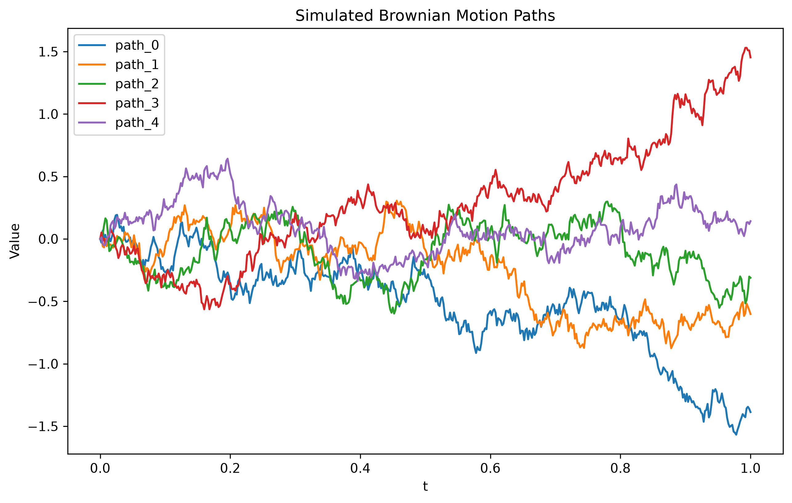

# Standard Brownian Motion: A Discrete Simulation Approach

## 1. Motivation

Standard Brownian motion (the Wiener process) is the foundational stochastic process underlying the majority of models used throughout this repository, from geometric Brownian motion in option pricing to fractional Brownian motion in long-memory time series modelling. Before extending to these more sophisticated processes, it is necessary to establish a correct, verifiable, and reproducible simulation of standard Brownian motion itself.

This project implements a discrete-time simulation of one or more sample paths of a Wiener process in C++, chosen specifically for the performance demands of the sequential, path-dependent computations involved, and exports the resulting paths for statistical and visual analysis in Python.

## 2. Mathematical Background

**Definition 2.1 (Standard Brownian Motion).** A stochastic process $\{W_t\}_{t \geq 0}$ is a standard Brownian motion if it satisfies the following properties:

1. $W_0 = 0$,
2. $W_t$ has independent increments: for $0 \leq s < t$, the increment $W_t - W_s$ is independent of $\{W_u : u \leq s\}$,
3. increments are normally distributed: $W_t - W_s \sim \mathcal{N}(0, t-s)$,
4. $W_t$ has almost surely continuous sample paths.

**Remark 1.** Property 3 is the defining feature exploited in the discrete simulation below. The standard deviation of an increment over an interval of length $\Delta t$ scales with $\sqrt{\Delta t}$, not $\Delta t$ itself — this is the origin of Brownian motion's characteristically jagged, nowhere-differentiable sample paths, and it is the property that later processes (notably fractional Brownian motion) modify by introducing dependence between increments.

### 2.1 Discretisation

To simulate a path over $[0, T]$, we partition the interval into $n$ steps of equal width

$$\Delta t = \frac{T}{n}.$$

By Property 3, each increment is drawn as

$$\Delta W_i \sim \mathcal{N}(0, \Delta t), \qquad i = 1, \dots, n,$$

and the discretised path is constructed via the cumulative sum

$$W_{t_i} = W_{t_{i-1}} + \Delta W_i, \qquad W_{t_0} = 0.$$

This is the standard Euler–Maruyama discretisation for a driftless, unit-diffusion process, and it converges to a true Wiener process sample path as $n \to \infty$.

## 3. Implementation

The simulation is implemented in `brownian_motion.h`, with the path-generating function accepting the horizon $T$, the number of steps $n$, and a shared Mersenne Twister random number generator (`std::mt19937`), from which increments are drawn via `std::normal_distribution`. Using a single, shared generator across multiple simulated paths avoids the correlation risk of re-seeding per path from a coarse-grained clock source.

The program (`brownian_motion.cpp`) accepts three optional command-line arguments:

| Argument | Meaning | Default |
|---|---|---|
| `numPaths` | Number of independent sample paths to simulate | 5 |
| `n` | Number of discretisation steps per path | 500 |
| `seed` | Fixed seed for the random number generator | none (genuinely random) |

When a seed is supplied, the simulation is fully reproducible: an identical seed, path count, and step count will always regenerate byte-identical output. This is verified directly by an automated test (Section 5).

## 4. Results



**Figure 1.** Five independent sample paths of a standard Brownian motion, simulated over $[0, 1]$ with $n = 500$ discretisation steps. Each path is generated independently via the cumulative-sum construction described in Section 2.1, using a shared random number generator across paths. All paths originate at $W_0 = 0$, consistent with Definition 2.1, and exhibit no discernible drift or convergence toward one another, reflecting the independent-increment property of the process. The visible roughness of each path, rather than smooth curvature, is characteristic of Brownian motion's almost-sure non-differentiability, and is a direct consequence of increments scaling with $\sqrt{\Delta t}$ rather than $\Delta t$ (Remark 1).

Qualitatively, the simulated paths in Figure 1 exhibit the expected properties of standard Brownian motion: all paths originate at $W_0 = 0$, exhibit no discernible drift, and display the continuous but nowhere-smooth character predicted by Definition 2.1. No two paths track one another, consistent with the independent-increment property.

## 5. Verification

Three properties of the implementation are verified via automated unit tests (Catch2), run on every commit via continuous integration:

1. every simulated path begins at $W_0 = 0$;
2. a path simulated with $n$ steps contains exactly $n+1$ points, consistent with the discretisation in Section 2.1;
3. two simulations using an identical seed produce identical output, confirming the reproducibility property described in Section 3.

## 6. Reproducing this Project

**Building:**
```
cmake -S brownian_motion -B brownian_motion/build
cmake --build brownian_motion/build
```

**Running:**
```
brownian_motion.exe [numPaths] [n] [seed]
```

**Running the test suite:**
```
brownian_motion_tests.exe
```

**Visualising results:**
```
pip install -r requirements.txt
python plot_paths.py
```

**Running a parameter sweep across path counts:**
```
chmod +x run_experiments.sh
./run_experiments.sh
```

## 7. Future Work

This project establishes the baseline simulation and reproducibility framework used throughout the remainder of the repository. Direct extensions include geometric Brownian motion and fractional Brownian motion, in which increments are no longer independent but exhibit long-range dependence governed by the Hurst exponent $H$.
