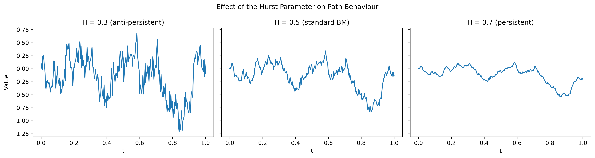

# Fractional Brownian Motion via Cholesky Decomposition

## 1. Motivation

The standard Brownian motion generator simulates a process with no memory: each increment is entirely independent of the last. This is a strong and, for many real phenomena, an unrealistic assumption. Many naturally occurring and financial processes exhibit either persistence (a tendency to continue trending) or anti-persistence (a tendency to revert), neither of which standard Brownian motion can represent.

Fractional Brownian motion (fBm) generalises the standard process by introducing a single parameter, the Hurst exponent $H \in (0,1)$, which controls the degree and direction of this memory. This project implements a correct simulation of fBm and demonstrates its behaviour across a range of $H$ values.

## 2. The Idea

A standard Brownian motion path can be thought of as a walker taking random steps with no memory: each step has nothing to do with the one before it. Fractional Brownian motion is the same idea, but the walker now has some memory, controlled by a dial, $H$:

* $H = 0.5$: no memory, this is standard Brownian motion,
* $H > 0.5$: the walker has momentum, a step in one direction makes a further step in that direction more likely, producing smoother, trending paths,
* $H < 0.5$: the walker is contrarian, a step in one direction makes a step in the opposite direction more likely, producing rougher, more jittery paths.

## 3. Formal Definitions

**Definition 3.1 (Fractional Brownian Motion).** A stochastic process $\{B_t^H\}_{t \geq 0}$ is a fractional Brownian motion with Hurst parameter $H \in (0,1)$ if:

1. $B_0^H = 0$,
2. $B_t^H$ has stationary, but not independent, increments,
3. $B_t^H$ is Gaussian, with covariance function

$$\mathbb{E}\left[B_s^H \, B_t^H\right] = \frac{1}{2}\left(|s|^{2H} + |t|^{2H} - |t-s|^{2H}\right)$$

**Remark 1.** When $H = 1/2$, this covariance reduces exactly to $\min(s,t)$, recovering standard Brownian motion, confirming fBm is a genuine generalisation rather than a separate process. This is verified directly in this project's test suite.

**Definition 3.2 (Self-Similarity).** A process $\{X_t\}$ is self-similar with index $H$ if, for any $a > 0$,

$$\{X_{at}\}_{t \geq 0} \overset{d}{=} \{a^H X_t\}_{t \geq 0}.$$

fBm satisfies this exactly: a portion of the path, rescaled, is statistically indistinguishable from the whole. This is the precise sense in which fBm is a fractal.

### 3.3 On the Name: Fractional and Fractal

The term fractional in fractional Brownian motion derives historically from fractional calculus, which generalises ordinary derivatives and integrals to non-integer orders; fBm's construction is tied to a fractional-order integral of white noise. The word fractal, coined separately by Benoit Mandelbrot, refers to self-similarity, the property in Definition 3.2. Despite arriving from different directions, the two are directly connected: fBm genuinely is a fractal process, and Mandelbrot himself used fractional Brownian motion specifically to model naturally occurring, self-similar phenomena, including coastlines and river networks, as well as financial price series. The Hurst parameter $H$ governs both the long-memory behaviour discussed below and the fractal dimension of the resulting path simultaneously.

**Definition 3.4 (Long-Range Dependence).** For $H > 1/2$, the autocorrelation of increments decays slowly enough that $\sum_{k=1}^{\infty} \rho(k) = \infty$, termed long-range dependence or long memory. For $H < 1/2$, increments are negatively correlated (anti-persistent); for $H = 1/2$, independent.

## 4. Simulation Method

Because increments are correlated (Definition 3.1, property 2), the cumulative-sum construction used for standard Brownian motion no longer applies, as that method relies on independence.

**Method: Cholesky Decomposition.** The $n \times n$ covariance matrix $\Sigma$ is constructed over discretised time points $t_1, \dots, t_n$, with

$$\Sigma_{ij} = \frac{1}{2}\left(t_i^{2H} + t_j^{2H} - |t_i - t_j|^{2H}\right).$$

As $\Sigma$ is symmetric positive semi-definite, it admits a decomposition $\Sigma = LL^T$, with $L$ lower triangular. Given a vector $Z$ of $n$ independent standard normal draws,

$$B^H = LZ$$

has exactly the covariance structure of Definition 3.1, producing a correctly correlated fBm sample path. This is implemented using Eigen's `.llt()` solver.

**Remark 2.** The Cholesky method is $O(n^3)$, limiting practical path lengths to a few thousand points. The Davies-Harte method, an FFT-based alternative with $O(n \log n)$ cost, is a natural extension for longer paths and is noted as future work.

## 5. Results



**Figure 1.** Simulated fBm sample paths at $H = 0.3$, $H = 0.5$, and $H = 0.7$, generated with an identical random seed so that the only difference between panels is the Hurst parameter itself. The progression in roughness from left to right is immediately visible: the $H=0.3$ path is visibly the most jagged, with frequent sharp reversals consistent with anti-persistence; the $H=0.5$ path exhibits the intermediate roughness expected of standard Brownian motion; the $H=0.7$ path is visibly the smoothest, sustaining directional drift for longer before reversing, consistent with persistent, long-memory behaviour.

## 6. Verification

Five automated unit tests (Catch2) verify: correct starting point $B_0^H = 0$; correct path length; reproducibility under a fixed seed; symmetry of the constructed covariance matrix; and, most importantly, that at $H=0.5$ the diagonal of the covariance matrix exactly matches $t_i$, directly confirming Remark 1's claim that fBm reduces to standard Brownian motion at $H = 0.5$.

## 7. Reproducing this Project

**Building:**
```
cmake -S fractional_brownian_motion -B fractional_brownian_motion/build
cmake --build fractional_brownian_motion/build
```

**Running:**
```
fbm.exe [H] [n] [numPaths] [seed]
```

**Running the test suite:**
```
fbm_tests.exe
```

**Visualising results:**
```
pip install -r requirements.txt
python plot_fbm_paths.py
python plot_hurst_comparison.py
```

**Running a sweep across Hurst values:**
```
chmod +x run_fbm_simulations.sh
./run_fbm_simulations.sh
```

## 8. Future Work

This project establishes that fBm can be correctly and reproducibly simulated for a chosen, known value of $H$. The next project in this repository addresses the inverse problem: given only a simulated (or real) price series, recovering the Hurst exponent through statistical estimation, first validated against the known ground truth established here, then applied to real FTSE 100 data to ask whether the index's price behaviour is closer to a random walk or exhibits genuine long memory.
