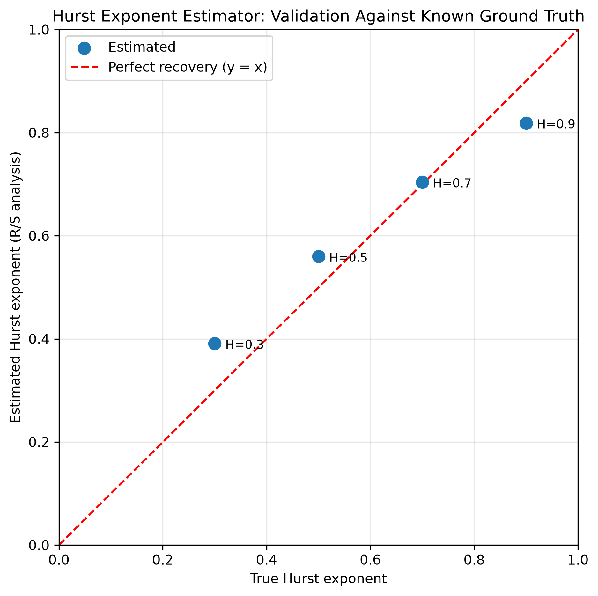
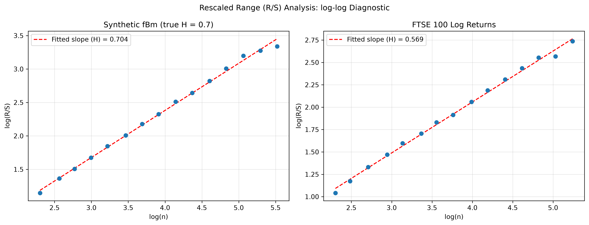

# Hurst Exponent Estimation via Rescaled Range Analysis

## 1. Motivation

The fractional Brownian motion project established that fBm can be correctly and reproducibly simulated for a chosen, known value of the Hurst exponent $H$. This project addresses the inverse problem: given only a time series, and no knowledge of how it was generated, can the underlying Hurst exponent be recovered through statistical estimation?

This is built in two parts. Part A validates the estimator against synthetic fBm with a known ground-truth $H$, generated using the Cholesky-based simulator from the previous project. Part B applies the same, now-trusted estimator to real FTSE 100 daily closing prices, asking a genuine question: does the UK's leading equity index behave like a pure random walk, or does it exhibit real long-range dependence?

## 2. Formal Definitions

**Definition 2.1 (Rescaled Range Statistic).** For a series of $n$ increments $\{X_1, \dots, X_n\}$ with sample mean $\bar{X}$, define the cumulative deviation series

$$Z_k = \sum_{i=1}^{k} (X_i - \bar{X}), \qquad k = 1, \dots, n.$$

The range and sample standard deviation of the increments are

$$R(n) = \max_{1 \le k \le n} Z_k - \min_{1 \le k \le n} Z_k, \qquad S(n) = \sqrt{\frac{1}{n-1}\sum_{i=1}^{n}(X_i - \bar{X})^2}.$$

The rescaled range statistic is $R(n)/S(n)$.

**Remark 1.** Hurst originally developed this statistic studying the Nile's water levels, well before fractional Brownian motion was formalised mathematically; the connection to $H$ (Definition 2.2 below) was established afterward.

**Definition 2.2 (The Hurst Relationship).** For a process with self-similarity parameter $H$ (fractional Brownian motion, Definition 3.2 of the previous project), the expected rescaled range scales as

$$\mathbb{E}\left[\frac{R(n)}{S(n)}\right] \sim c \cdot n^{H} \quad \text{as } n \to \infty,$$

for some constant $c$. Taking logarithms gives a linear relationship

$$\log\left(\frac{R(n)}{S(n)}\right) \approx \log(c) + H \log(n),$$

so that computing $R(n)/S(n)$ across several window sizes $n$ and fitting a straight line to $\log(n)$ against $\log(R/S)$ yields an estimate of $H$ as the fitted slope.

**Remark 2.** This is a moment-based estimator, not a maximum-likelihood one, and it is known to carry a systematic bias toward $H=0.5$ at extreme true values, since the asymptotic relationship in Definition 2.2 is only exact as $n \to \infty$, while any real series has finite length. This bias is visible directly in the validation results below and is discussed rather than hidden.

## 3. Method

For a given series, the rescaled range is computed within non-overlapping windows of a fixed size $n$, averaged across all such windows, and this is repeated across a range of window sizes spaced logarithmically from small to large. A least-squares line is then fitted to $\log(n)$ against $\log(R/S)$; its slope is the Hurst exponent estimate.

**Part A (validation):** fBm sample paths are generated (via the previous project's Cholesky method) at four known values, $H \in \{0.3, 0.5, 0.7, 0.9\}$, and the estimator is applied to each path's increments, checking recovery against the known ground truth.

**Part B (application):** the same estimator is applied to the log returns of real FTSE 100 daily closing prices, with no known ground truth, only the question of what the data itself implies.

## 4. Results

### 4.1 Validation

| True $H$ | Estimated $H$ | Absolute Error |
|---|---|---|
| 0.3 | 0.391 | 0.091 |
| 0.5 | 0.560 | 0.060 |
| 0.7 | 0.704 | 0.004 |
| 0.9 | 0.819 | 0.081 |



**Figure 1.** Estimated Hurst exponent plotted against the true value used to generate each synthetic fBm path, against the line of perfect recovery. The estimator is most accurate near $H=0.7$, essentially exact, and shows the expected systematic bias toward $0.5$ at the extremes ($H=0.3$ estimated too high, $H=0.9$ estimated too low), consistent with Remark 2. This bias is a genuine, documented property of R/S analysis with finite sample sizes, not an implementation error.

### 4.2 The Estimation Mechanism



**Figure 2.** The log(n) against log(R/S) relationship underlying each estimate (Definition 2.2), for the synthetic $H=0.7$ path (left) and real FTSE 100 log returns (right). In both panels the points sit closely along the fitted line across the full range of window sizes, confirming the power-law relationship holds in practice, not only in theory. The FTSE panel shows slightly more scatter than the synthetic panel, particularly at larger window sizes, which is expected given real market data carries noise a perfectly-specified synthetic model does not.

### 4.3 Application to Real Data

The estimated Hurst exponent for FTSE 100 daily log returns is $H \approx 0.569$. Since $H > 0.5$, this suggests the index exhibits mild persistent, long-range dependent behaviour over the sample window, rather than following a pure random walk. This is a plausible, moderate finding, consistent with existing literature suggesting many equity indices show weak long memory rather than either strict efficiency or strong trending behaviour.

## 5. Verification

Five automated unit tests (Catch2) verify: the linear regression routine exactly recovers a known slope and intercept from an exact linear series; increment and log-return computations produce correctly sized output; the rescaled range statistic is exactly zero for a constant series; the estimator recovers $H$ close to $0.5$ for genuinely independent Gaussian noise; and the estimator correctly detects persistence ($H > 0.5$) in synthetic fBm generated with a known $H=0.7$.

## 6. Reproducing this Project

**Building:**
```
cmake -S hurst_estimation -B hurst_estimation/build
cmake --build hurst_estimation/build
```

**Running:**
```
hurst.exe [seed]
```

**Running the test suite:**
```
hurst_tests.exe
```

**Visualising results:**
```
pip install -r requirements.txt
python plot_hurst_validation.py
python plot_loglog_diagnostic.py
```

**Running validation across multiple seeds:**
```
chmod +x run_hurst_simulations.sh
./run_hurst_simulations.sh
```

## 7. Future Work

Having established both a way to simulate long-memory processes (fractional Brownian motion) and a way to detect long memory in data, the next two projects in this repository turn to short-memory dynamics: an AR(1) process, the short-memory counterpart to fBm, and a GARCH-lite volatility model, capturing time-varying rather than constant volatility. Both are fitted to the same real FTSE 100 data used here, extending this project's validate-then-apply structure to a genuinely different class of model.
