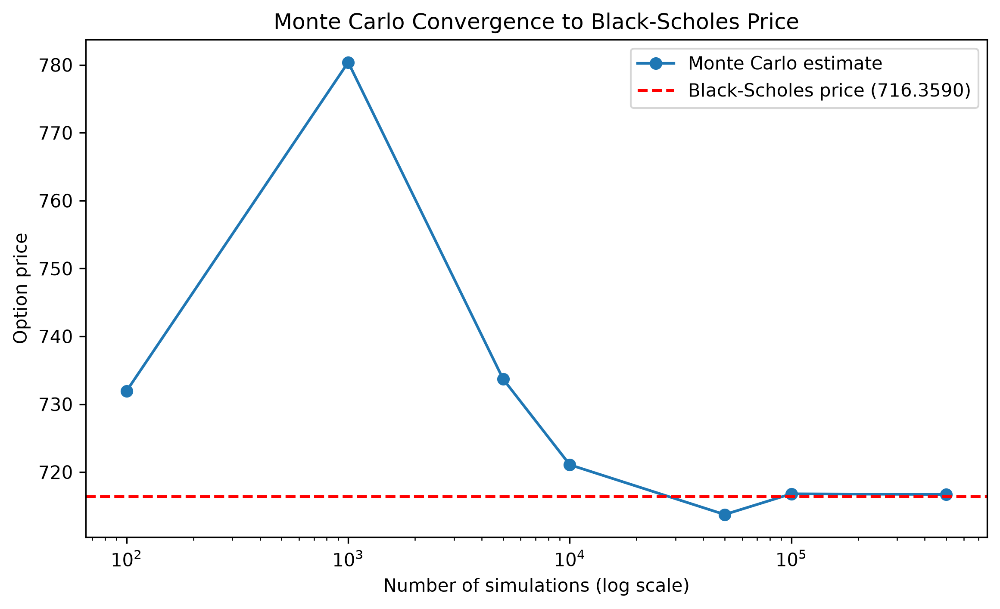

# Monte Carlo Option Pricing on the FTSE 100

## 1. Motivation

This project extends the standard Brownian motion generator into a genuinely applied setting: pricing a real financial derivative on real market data. Rather than working with an illustrative asset, all parameters ($S_0$, $\sigma$) are estimated directly from historical FTSE 100 closing prices.

Two independent methods are used to arrive at the same price: Monte Carlo simulation of the underlying price process, and the closed-form Black-Scholes formula. Agreement between them gives us evidence that the simulation is correctly implemented.

## 2. Basic Definitions

**Definition 2.1 (European Call Option).** A European call option is a contract giving its holder the right, but not the obligation, to purchase an underlying asset at a predetermined strike price $K$ on a fixed maturity date $T$. Its payoff at maturity is

$$\text{Payoff} = \max(S_T - K, 0),$$

where $S_T$ is the price of the underlying asset at time $T$. The option has value only if the asset finishes above the strike.

**Definition 2.2 (Geometric Brownian Motion).** A stochastic process $\{S_t\}_{t \geq 0}$ follows geometric Brownian motion if it satisfies the stochastic differential equation

$$dS_t = \mu S_t \, dt + \sigma S_t \, dW_t,$$

where $\mu$ is the drift, $\sigma$ is the volatility, and $W_t$ is a standard Brownian motion (see the Brownian motion project's Definition 2.1). GBM is the standard model for asset prices, chosen because it guarantees $S_t > 0$ for all $t$, a property a plain Brownian motion price model would not have, and because its log-returns are normally distributed, consistent with empirical observations of many real asset prices over short horizons.

**Definition 2.3 (Risk-Neutral Measure).** For pricing purposes, an asset's real-world drift $\mu$ is replaced by the risk-free rate $r$. This is the risk-neutral measure: under it, the expected return on every asset equals the risk-free rate, and the price of any derivative can be computed as the discounted expectation of its payoff. This substitution is what allows an option to be priced without needing to know or estimate the asset's true real-world expected return, only its volatility.

**Remark 1 (Black-Scholes Assumptions).** The closed-form Black-Scholes formula used for comparison in this project assumes: the underlying follows GBM with constant volatility $\sigma$; the risk-free rate $r$ is constant; markets are frictionless (no transaction costs, unlimited borrowing/lending at $r$); and the option is European (exercisable only at maturity). Real markets violate several of these assumptions. Within this project, these assumptions are treated as a simplifying baseline against which the Monte Carlo method is validated.

## 3. Mathematical Method

### 3.1 Volatility Estimation from Real Data

Given a series of daily closing prices $P_0, \dots, P_n$, the daily log return is

$$r_i = \ln\left(\frac{P_i}{P_{i-1}}\right).$$

The annualised volatility is the sample standard deviation of these returns, scaled by the square root of the number of trading days in a year:

$$\sigma = \text{sd}(r_i) \times \sqrt{252}.$$

$S_0$ is taken as the most recent closing price in the dataset.

### 3.2 Simulating the Terminal Price

Under the risk-neutral measure, the exact solution to the GBM SDE (Definition 2.2) gives the terminal price directly, without needing to simulate the full path:

$$S_T = S_0 \exp\left[\left(r - \tfrac{1}{2}\sigma^2\right)T + \sigma W_T\right], \qquad W_T \sim \mathcal{N}(0, T).$$

### 3.3 Monte Carlo Pricing

For $N$ independent simulated terminal prices $S_T^{(1)}, \dots, S_T^{(N)}$, the Monte Carlo price estimate is the discounted average payoff:

$$\hat{C} = e^{-rT} \cdot \frac{1}{N} \sum_{i=1}^{N} \max\left(S_T^{(i)} - K, 0\right).$$

By the law of large numbers, $\hat{C} \to C$ (the true price) as $N \to \infty$.

### 3.4 Black-Scholes Closed Form

$$C = S_0 \, \Phi(d_1) - K e^{-rT} \, \Phi(d_2), \qquad d_1 = \frac{\ln(S_0/K) + (r + \sigma^2/2)T}{\sigma\sqrt{T}}, \qquad d_2 = d_1 - \sigma\sqrt{T},$$

where $\Phi$ is the standard normal cumulative distribution function.

## 4. Results

### 4.1 Baseline Pricing

Using $S_0$ and $\sigma$ estimated from real FTSE 100 data (Section 3.1), an at-the-money European call ($K = S_0$, $T = 1$ year, $r = 4\%$) was priced at 100{,}000 simulations:

| Method | Price |
|---|---|
| Monte Carlo | 717.42 |
| Black-Scholes | 716.36 |
| Absolute difference | 1.06 (0.15%) |

### 4.2 Convergence



**Figure 1.** Monte Carlo price estimate as a function of the number of simulated paths (log scale), against the fixed Black-Scholes price (red dashed line). At low simulation counts the estimate exhibits substantial sampling noise, consistent with the $O(1/\sqrt{N})$ convergence rate of Monte Carlo methods; by $N \approx 10^5$, the estimate has visibly settled onto the true price, providing direct visual evidence of convergence rather than a single-point comparison alone.

### 4.3 Pricing Across Strikes

The pricer was also run across a range of strikes (90%–110% of $S_0$), confirming Monte Carlo and Black-Scholes agree closely across moneyness levels, not only at-the-money, and that the resulting prices decrease monotonically in $K$, consistent with option pricing theory.

## 5. Verification

Five automated unit tests (Catch2) verify: correct extraction of $S_0$ and a strictly positive $\sigma$ from a known price series; Monte Carlo agreement with Black-Scholes within a fixed tolerance at high $N$; reproducibility under a fixed seed; and correct limiting behaviour for deep in-the-money and deep out-of-the-money options.

## 6. Reproducing this Project

**Building:**
```
cmake -S monte_carlo -B monte_carlo/build
cmake --build monte_carlo/build
```

**Running:**
```
monte_carlo.exe [K_multiplier] [r] [T] [numSimulations] [seed]
```

**Running the test suite:**
```
monte_carlo_tests.exe
```

**Visualising convergence:**
```
pip install -r requirements.txt
python plot_convergence.py
```

**Running a strike sweep:**
```
chmod +x run_monte_carlo_simulations.sh
./run_monte_carlo_simulations.sh
```

## 7. Future Work

The volatility estimate used here is a single, static value calculated over the sample window, and the increments driving the underlying price process are independent of one another, a direct consequence of the GBM assumption in Definition 2.2. The next project in this repository asks what changes when that independence assumption is dropped, fractional Brownian motion introduces long-range dependence between increments, governed by the Hurst exponent.
